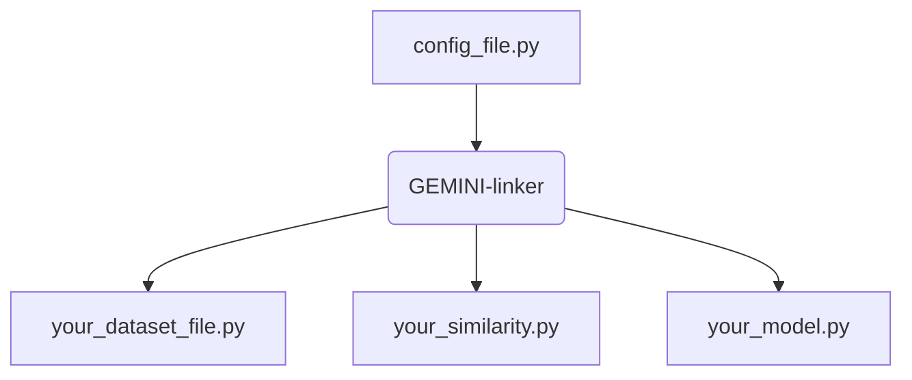

# GEMINI

## Introduction

This repo contains a tool performing clustering on a dataset and models of *your own* by maximising a **Generalised Mutual InformatIon** (GEMINI).
It also allows to reproduce experiments from our publication:

---
@proceedings{
    title={Generalised mutual information for Discriminative Clustering},
    authors={L. Ohl, P.A. Mattei, C. Bouveyron, W. Harchaoui, A. Droit, M. Leclercq, F. Precioso}
}
---

**Important**: The core implementation of all GEMINI computations can be found in the file `losses/gemini.py`.

1. [Reproducing experiments from the paper](#reproducing-experiments-from-the-paper)
   1. [MNIST](#mnist)
   2. [CIFAR10](#cifar-10)
   3. [Moons](#moons)
   4. [Dirac model](#dirac-model)
   5. [Other](#other)
2. [What is a GEMINI?](#what-is-a-gemini)
3. [Documentation](#documentation)
   1. [Use case](#use-case)
   2. [Configuration file](#configuration-file)
   3. [Examples](#examples)
   4. [Designing your model](#designing-your-model)
   5. [Viewing your results](#viewing-results)

## Reproducing experiments from the paper

We list here the command lines to reproduce the experiments from our paper, topic by topic. Make sure to have installed all packages from `requirements.txt`. The general command to reproduce an experiment is to run:
```commandline
python main.py --config path/to/some/configuration/files
```

### MNIST

Use the configuration files located in `config_experiments/mnist/lenet5` and `config_experiments/mnist/mlp`.

### CIFAR 10

You must first extract the features from SIMCLR that we do not provide. Please run before:

```commandline
cd others && python exporting_simclr_features.py
```

You may then check that simclr features were exported to files located in the `data/custom_similarities` folder.
You can then use the configuration files located in `config_experiments/cifar10` to use the lenet 5 model and
`config_experiments/cifar10_resnet` to use the resnet model.

### Moons
Make sure to first cythonize the file `utils/floyd_warshall/fw.pyx` before running the main script.
To reproduce the moons' experiment, use the configuration files located in config_experiments/moons

### Dirac model

To reproduce the experiment with categorical models, i.e. a mixture of delta Dirac distributions, run:
```commandline
cd others && python dirac_models.py
```

### Other

You will find several script in the `other` folder that were used for figure generation, or baselines such as KMeans and GMM.

## What is a GEMINI?
 A GEMINI is simple metric looking alike the standard mutual information. The standard mutual information is defined by:

```math
\mathcal{I}(X;Y) = \mathbb{E}_{y \sim p(y)}[D_\text{KL}(p(x|y)||p(x))]\quad,
```

where $`x`$ and $`y`$ are two random variables and $`D_\text{KL}`$ refers to the Kullback-Leibler divergence. For this repo and in the global context of clustering, the random variable $`x`$ can be either continuous or discrete when standing for the data, whereas $`y`$ is discrete and represents the cluster assignments among $`K`$ chosen clusters.

GEMINIs improve this notion by changing the Kullback Leibler divergence for other types of divergence or distance noted $`D`$. While the standard mutual information only compares the distribution of a cluster against the entire data distribution, GEMINIs introduce the idea of comparing cluster distributions against one another . The two concepts are respectively named *one-vs-all* (OvA) and *one-vs-one* (OvO):

```math
\mathcal{I}^\text{OvA}_D(X;Y) = \mathbb{E}_{y\sim p(y)} [D(p(x|y) || p(x))] \quad,
```

```math
\mathcal{I}^\text{OvO}_D(X;Y) = \mathbb{E}_{y_1, y_2 \sim p(y)} [D(p(x|y_1) || p(x|y_2))]\quad.
```

In the OvO setting, the two random variables $`y_1`$ and $`y_2`$ are independent.
The currently supported distance (or divergence) for $`D`$ are:
+ The KL divergence
+ The total variation
+ The Squared Hellinger
+ The Maximum Mean Discrepancy (MMD), also known as kernel score
+ The Wasserstein Distance

The last two elements are related to *Integral Probability Metrics* (IPM). They require additional information on the data passed through a distance or kernel on the data space $`\mathcal{X}`$, e.g. euclidean distance, RBF kernel. To indicate both concepts of kernel and distance at once in this repo, we name them *similarity*.

#### Known properties
1. Similar to the mutual information, $`X \perp Y \implies \mathcal{I}^\text{OvO}(X;Y)=\mathcal{I}^\text{OvA}(X;Y)=0`$
2. For any IPM distance in binary clustering: $`\mathcal{I}^\text{OvA}(X;Y) = \mathcal{I}^\text{OvO}(X;Y)`$
3. GEMINIs do not necessarily use all clusters. This means that the number of cluster $`K`$ is only a maximum number.

## Documentation

### Use case

You may consider this repo as a complete black box that will be able to link your torch model, your personal dataset and, if using IPMs, your custom similarity. The global setup can be described by this diagram:


You must provide therefore a configuration file that will tell the program where to fetch your personal data files, model files and similarity files as well as parameters for training, such as the number of epochs, the number of clusters, the batch size, the GEMINI choice etc.

You can then call the program by running:
```bash
python main.py --config YOUR_CONFIG_FILE [--model_name MODEL_NAME] [--seed SEED]
```
The parameter `config` is mandatory and should indicate your configuration file. The two other options are optional. `model_name` sets the name of the folder inside which all results of your run will be saved instead of a default auto-generated folder. Finally, `seed` sets the random seed when specified.

### Configuration file

We provide a template config with a detailed explanation of all parameters in `configs/template_config.yml`. We detail here all available options for parameters:

+ `gemini\distance`: wasserstein, mmd, kl, tv, hellinger
+ `gemini\ovo`: true,false
+ `similarity_fct`: linear, gaussian, euclidean, sqeuclidean or a relative path to your custom similarity
+ `use_cuda`: true,false
+ `optimiser`: adam, rmsprop, sgd

### Designing your model

#### Model design
Models design are threefold in this repo. We consider models as composition of three distinct elements: an encoder $`\mathcal{E}`$, a clustering head $`\mathcal{C}`$. and a decoder $`\mathcal{D}`$. Each should be designed in a separate file and passed to the respective parameters `model\encoder`, `model\clustering_head` and `model\decoder` of the configuration file. Each file **must** have a function named `get_model(**kwargs)`. This function will be called to get a part of your model, and its kwargs are the ones you provided in dictionary format inside the configuration file at `model\encoder_kwargs`, `model\clustering_head_kwargs` and `model\decoder_kwargs`.

All three files should return a plain `nn.Module` torch model. Cuda and data parallelism is already handled by the program itself.

The clustering output is:
```math
p(y|x) = \text{Cat}(\mathcal{C} \circ \mathcal{E}(x))\quad.
```

*Note*: the decoder $`\mathcal{D}`$ is only required when a reconstruction loss is specified, i.e. `regularisations\reconstruction_weight`>0. Otherwise it is ignored.

Examples can be found in `models\custom_models`

#### Dataset design

Similarly to model files, your dataset file should simply contain two functions:
+ `get_train_dataset(**kwargs)` which returns the dataset used for training. It is mandatory.
+ `get_val_dataset(**kwargs)` which returns the dataset for validation. Optional. If no validation function is provided, no validation will be performed during training.

Both methods must return a dataset class inheriting from `torch.utils.data.Dataset`, e.g. `TensorDataset`, `MNIST` etc.

The kwargs are provided by the configuration file from the parameter `dataset_kwargs `.

Examples can be found in `data\custom_datasets`.

#### Similarity design

To provide your own similarity, you must write a class inside your files which inherits from the base class `data.similarities.Similarity`. The class must have a `__call__(self,X,Y)` to compute the similarity between two elements X and Y.

**Note**: at the moment, we cannot support distances or kernels that are based on neighborhoods orderings. Indeed, the similarities are pre-computed batch-wise during initialisation and batch sampling breaks the correctness of nearest neighbor searching.

Example is provided in `data\custom_datasets\transform_similarity.py`.

### Examples

We provide two fully running examples which can be performed with commands:

```
python main.py --config configs/examples/iris_mlp_tv_ova.py
python main.py --config configs/examples/mnist_mmd_ovo_vat.py
```
The first example fits a simple MLP of one hidden layer of 10 nodes to the iris dataset using the GEMINI $`\mathcal{I}_\text{TV}^\text{OvA}`$.
The second example performs clustering of MNIST using a convolutional autoencoder based on the LeNet5 architecture. VAT regularisation is further added with entropy loss to ensure balanced clusters.

### Viewing results

The results are exported in the folder you specified as `result_path/model_name`. The metrics can be viewed throughout training using tensorboard.

```
tensorboard --logdir result_path/model_name
```
